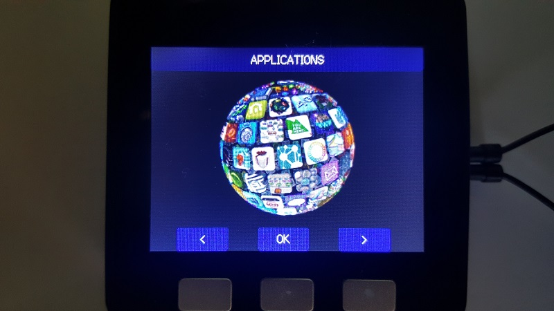
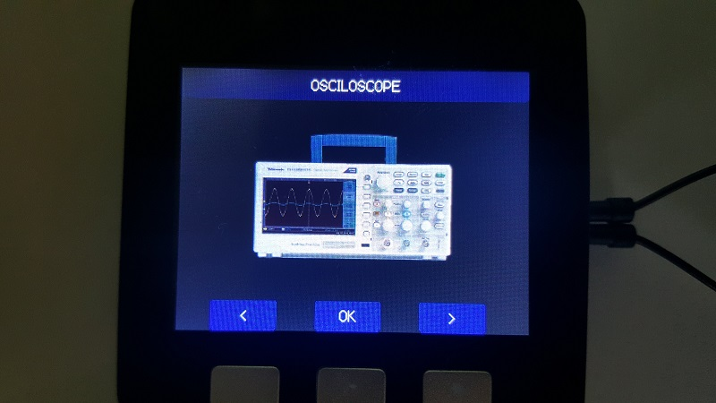

# M5Stack MultiApp Advanced

### This is a firmware that include several "sketches" as builtin apps
### Using this app, M5Stack can run all included apps without reflashing/rebooting
#### This is the continued development of the original M5Stack MultiApp firmware
#### This project is made on PlatformIO IDE
#### With some minor work it can be adapted to other IDE's like VisualStudio+VisualMicro or Eclipse.

This project use modifed M5Stack M5StackSAM and EspAudio libraryes from project local storage.

## The project include:
- Applications
  - Dual Channel Oscilloscope
  - WebRadio
    + Can play MP3 streams
    + Web Radio streams are stored on SD Card on "RadioStations.txt" file
    + Support theoretically unlimited station list
    The stations must be defined on separate lines as follow: "StationName=StationLink;"
  - WebServer with web based SD File manager that support
    + List SD Folders
    + Create Folder
    + Delete Folder
    + Download files
    + Upload Files
    + Display Files Content (images, text, etc...)
  - SD Browser that support
    + Display Jpeg files on the screen
    + Resize Jpeg to fit to screen size
    + Play MP3 Files using Mp3 Player App
    + Display File properties for the files that can't be open with included apps
  - Tools list
    + Wifi Packet Monitor
    + Wifi Scanner
    + I2C Scanner
    + DHT Sensor reader
      + Support any DHT sensor type
    - Stopwatch
  - Games (just for fun)
    + Space Shooter
    + Flappy Bird
- Return (to menu root)

### The Oscilloscope Menu Structure:

- Freeze Frame
+ Start / Stop
- Sesitivity for
+1V , 500mV, 200mV, 100mV, 50mV per Divizion
-
