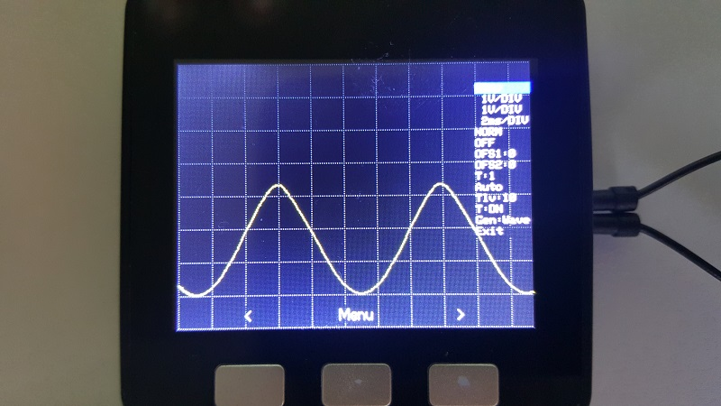
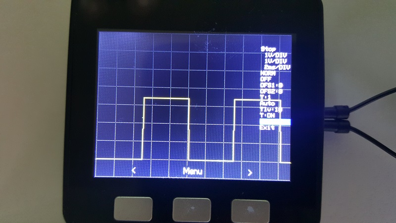
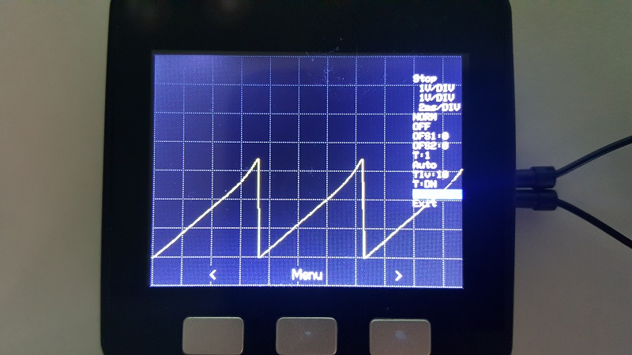
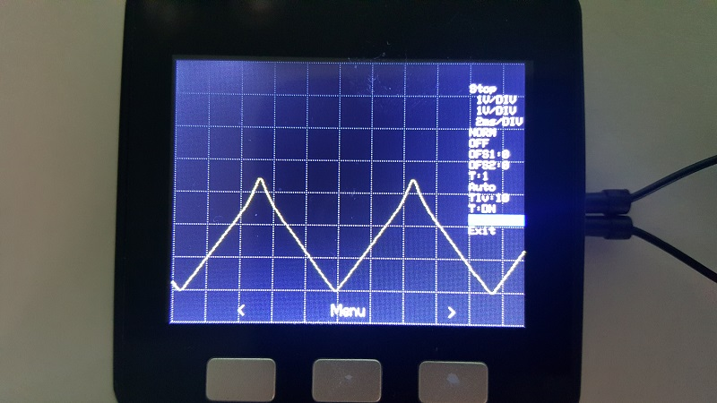
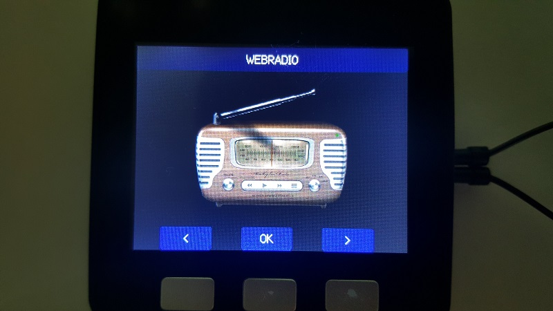

# M5Stack MultiApp Advanced

### This is a firmware that include several "sketches" as builtin apps
### Using this app, M5Stack can run all included apps without reflashing/rebooting
#### This is the continued development of the original M5Stack MultiApp firmware
#### This project is made on PlatformIO IDE
#### With some minor work it can be adapted to other IDE's like VisualStudio+VisualMicro or Eclipse.

This project use modifed M5Stack M5StackSAM and EspAudio libraryes from project local storage.

## The project include:
- Applications

  - Dual Channel Oscilloscope
    - Pin 35 Channel 1
    - Pin 36 Channel 2
    - Pin 26 Signal Generator

    - Oscilloscope Menu Structure:
      + Stop / Run frame
      + Sensitivity for each channel:
        + 50mV, 100mV, 200mV, 500mV, 1V per Divizion
      + Channel mode for each channel
        + Normal, Inverted, Off
      + Offset for each channel
      + Trigger Switch
        + Trigger from Channel 1 or Channel 2
      + Trigger Mode
        + Auto, Normal, Scan
      + Trigger Level 0 - 100 %
      + Trigger Edge
        + Rising (UP)
        + Falling (DN)
      + Internal Signal Generator mode
        + Wave signal
        + Square signal
        + Triangular Signal 1
        + Triangular Signal 2
        + Signal Generator OFF
      + Exit Oscilloscope App
      
   
  
  - WebRadio
  
  
  
    + Support Volume Adjustment
    + Support Stations change on the fly
    + Long press NEXT key to exit from Radio App
    + Display Volume Level
    + Display Data buffer state
    + If the connection is lost or the buffer get empty, will try to recover the connection. 
    + If the connection can't be recovered, will connect to the next station on the list
    + Can play MP3 streams
    + Web Radio streams are stored on SD Card on "RadioStations.txt" file
    + Support theoretically unlimited station list
        - The stations must be defined on separate lines as follow: "StationName=StationLink;"
  - WebServer with web based SD File manager that support
    + List SD Folders
    + Create Folder
    + Delete Folder
    + Download files
    + Upload Files
    + Display Files Content (images, text, etc...)
  - SD Browser that support
    + Display Jpeg files on the screen
    + Resize Jpeg to fit to screen size
    + Play MP3 Files using Mp3 Player App
    + Display File properties for the files that can't be open with included apps
  - Tools list
    + Wifi Packet Monitor
    + Wifi Scanner
    + I2C Scanner
    + DHT Sensor reader
      + Support any DHT sensor type
    - Stopwatch
  - Games (just for fun)
    + Space Shooter
    + Flappy Bird
- Return (to menu root)
- System
  + System Informations
    + CPU Frequency, Number of cores, Chip Revision, Flash Speed, Current Free RAM space, Wifi MAC address, Wifi IP Address, Wifi current Mode
    + Minimum FREE heap (RAM) since the device was started, Flash Size, SPIFFS Size, SPIFFS used space, SD Card Type, SD Card Size, SD Card used space
    
